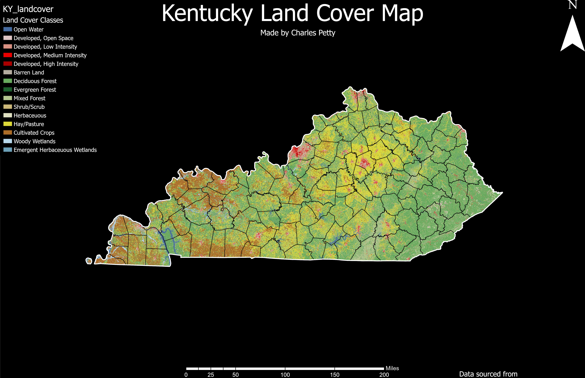

# Kentucky Landcover & UK Campus Layouts
### Made by Charles Petty for GEO409 

## Kentucky Landcover Layout

The following map was made with ArcGIS Pro using the kysmallscale geodatabase.

[Kentucky Land Cover Map PDF](C:\CharlesGIS\geo409-field-trip\KentuckyLandCoverLayout.pdf)

## UK Campus Layout