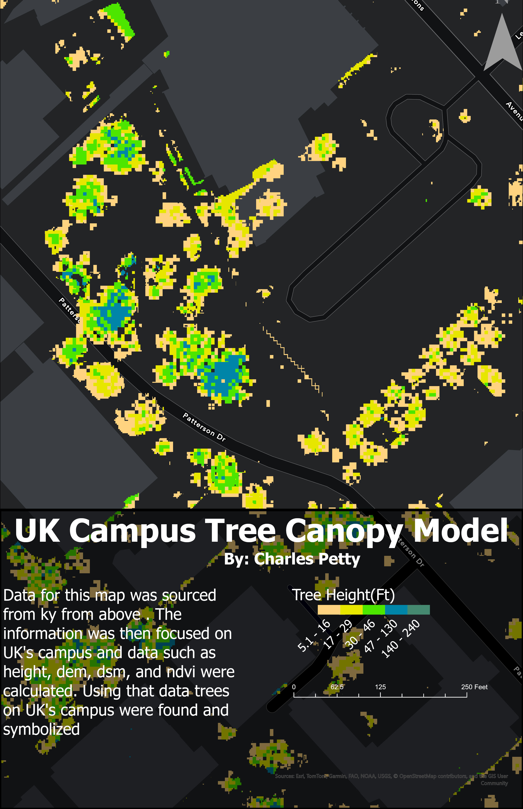

# Kentucky Landcover & UK Campus Layouts
### Made by Charles Petty for GEO409 

## Kentucky Landcover Layout

The following map was made with ArcGIS Pro using the kysmallscale geodatabase.

[Kentucky Land Cover Map PDF](KentuckyLandCoverLayout.pdf)

## UK Campus Layout

The follwing map was made with ArcGIS Pro using data from [kyfromabove](https://kyfromabove.ky.gov/).

[UK Campus Map PDF](CampusTreeCanopyModel.pdf)

